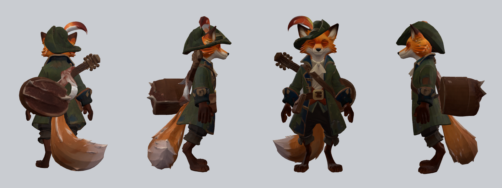
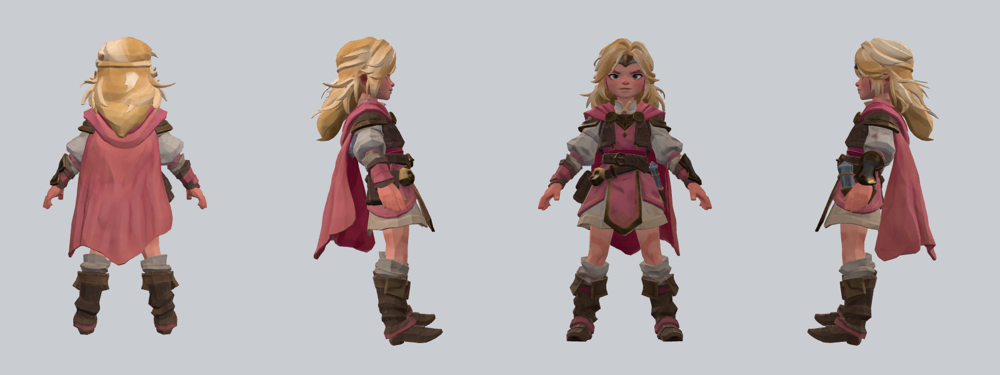

# Pixal3D on the M5: first two runs (2026-09-29)

Setup: image-to-3dlab v0.3.4 in `~/3d-lab/image-to-3dlab` on the M5 MacBook Pro
(32 GB). Pixal3D Q8_0 single-view, `--seed 42`, 8 steps, res 1024, u2net
matting (BiRefNet-lite was installed afterwards, not used in these runs).
Inputs are in `~/3d-lab/inputs/` (12 Eventyrland figures, 4 Krea 2 princesses).
Renders: headless Chromium + three.js, four angles, in `docs/img/`.
GLBs (~36 MB each) stay in `~/3d-lab/out/pixal3d/`, not in git.

| Input | Time | Triangles | GLB |
|---|---|---|---|
| eventyrland-fox-bard.png (gpt-image) | 430 s | 964k | 36 MB |
| eventyrer-princess-krea-1.jpeg (Krea 2) | 303 s | 933k | 36 MB |

Process peak RSS was 1.9-2.2 GB; the model itself sits in Metal memory
(the tool reports 25.5 GB available).

Observations
- Front view is very faithful to the picture on both, textures stay flat and
  painterly, no separate repaint needed.
- Fox: the lute flat disc became a thick drum in side view; tail tip has small
  floating spikes. Back is plausible.
- Princess (Krea 2): hair, cape and boots hold up from the back. The face
  drifts slightly (brows read angrier than the source).
- ~1M triangles: needs retopology/decimation before game use. Not rigged.
- Still to do: compare with the WaveSpeed TRELLIS GLBs, run TRELLIS.2 locally,
  rerun with BiRefNet, try the other 14 inputs.




## First run from Sleeper (zap-mesh, 2026-09-29)

| Input | Time | Triangles | GLB |
|---|---|---|---|
| eventyrland-mushroom-kid.png (gpt-image) | 542 s | 963k | 37 MB |

Run over plain ssh from Sleeper, results pulled back to Sleeper at
`~/zshots/zap-mesh/eventyrland-mushroom-kid/` (GLB, views, summary). Front and
back hold up; the cap, leaf cape and acorn are clean. Sleeper now runs meshes
with `zap-mesh <image>` (`~/github/sleeper/zap/README.md` on Sleeper), which
honours `~/3d-lab/out/.gpu-lock` and runs a snapshot copy of `bin/mesh`.

## Recipe: "lag 3D av dette bildet"

The reference copy lives on Sleeper (`~/github/sleeper/zap/3d-recipe.md`),
since zap comes and goes. Copied here 2026-09-29.

### The image

- **Clean or pre-masked background.** Plain flat light grey or white, or a
  PNG with the background already cut out. The tool mattes the subject itself
  (u2net; BiRefNet is installed), and every leftover patch of scenery becomes
  geometry.
- **The whole subject in frame.** Head to toe, nothing cropped, some margin.
  A cut-off foot comes back as a flat stump.
- **One subject, centered.** No second figure, no props lying next to it.
- **Characters in A-pose.** Standing upright, facing forward, arms angled a
  little away from the body, legs shoulder-width apart, hands visible. Arms
  pressed to the body fuse with it; a T-pose is fine but wastes width.
- **No thin, loose parts.** Lute necks, wands, bowstrings, loose hair strands,
  tail tips, feathers and floating runes come back thick, spiky or as
  blobs (the fox's lute turned into a drum). Make them chunky, or leave them
  off and add them in the engine.
- **No cast shadows** on the ground, and even lighting. A shadow is read as
  a dark slab under the feet; dramatic lighting gets baked into the texture.
- **3/4 front view for objects, straight front for characters.** The back is
  invented; the more the front shows, the less it has to guess.

### Style

- **Inside the village walls:** the flat, cosy Eventyrland style: soft
  rounded shapes, hand-painted look, warm natural colours. This is the
  TRELLIS reference style, made with GPT Image 2.5 Sunburst.
- **Outside the walls:** bolder painterly Krea 2 art (Fortiche / League of
  Legends direction, decided 2026-09-29), made with Krea 2 turbo.

Either way the texture comes out flat and painterly with no repaint step, so
the look of the image is the look of the model.

### Prompt suffixes that worked

Objects and scenery, inside the walls (every `refs/*.json` prompt ends with
this; start with "a <thing>, <details>."):

> Chunky solid closed shapes with no thin, loose or see-through parts.
> Stylized 3D game asset in a modern feature-animation film style: soft
> rounded appealing shapes, hand-painted-feeling textures, warm natural
> harmonious colours. A single isolated object, centered, fully visible, 3/4
> front view, on a plain flat light-grey background, soft even studio
> lighting, no ground shadow, no text, no people.

Model: `wave --model gpt-image-2.5-sunburst` (or the Venice burner), 1:1.

Characters, outside the walls (Krea 2; the fixer.ink records tagged
`outside-walls` hold all 35 prompts). Style lead, then "A full-body stylized
illustration of <who, clothes, one prop, face>", then:

> ..., presented in a neutral A-pose, designed as a clear character reference
> for 3D model generation. The character stands upright, facing directly
> forward, arms slightly angled away from the body, legs shoulder-width apart,
> hands fully visible, and the entire figure clearly readable from head to
> toe. Clear silhouette readability, balanced proportions, clean separation
> between body parts. Centered, symmetrical composition, isolated against a
> simple plain background, minimal environmental clutter. Lighting painterly
> and appealing, even and descriptive rather than dramatic, no deep shadows
> hiding anatomy or costume details. Preserve the painterly brush texture
> while keeping clothing layers, accessories and body forms clearly visible.
> Worn-in, functional, believable fantasy clothing. No text.

The style lead used: "A richly painterly animated-illustration style built on
visible, confident brushstroke texture layered directly into rendering rather
than smoothed away, a fusion of hand-painted textural depth with clean
animation-ready linework, and a bold painterly-meets-graphic animation
intensity that feels both illustrated and alive. Influenced by: Fortiche
Production, League of Legends concept-art tradition, painterly animation
technique, cinematic stylized character-design practice."

Krea 2 route: WaveSpeed model `wavespeed-ai/krea-v2/turbo` ($0.012 per 1k
image, portrait 2:3 or 9:16), for example
`wavespeed run wavespeed-ai/krea-v2/turbo -p "…" -i aspect_ratio=2:3 --download` (see the `wavespeed`
skill). wave-cli's `--model krea` is a different endpoint
(`krea-v2-medium-turbo`, $0.015). Loose runes or glyphs painted on a
character (seen on the Krea mage) can turn into bumps: prompt them away for
3D.

### Then

```bash
zap-mesh portrait.png          # → ~/zshots/zap-mesh/portrait/portrait.glb + -views.png
```

Check `-views.png` (front, sides, back) before using the GLB. ~1M triangles:
decimate before it goes into a game.

## Game-ready topology with Blender (2026-09-29, zap-Claude)

Blender 5.2.2 is installed at `~/Applications/Blender.app` (brew cask, `--appdir`).
Wrapper: `~/3d-lab/bin/lowpoly <in.glb> <out.glb> [faces=20000] [tex=2048]`, which runs the lab's
`scripts/blender_retopo_bake.py` (voxel remesh, QuadriFlow, selected-to-active texture bake).

| Fox, from the 964k-triangle Pixal3D GLB | Result |
|---|---|
| Blender Decimate modifier to 30k faces | Shape holds, **texture shatters** (white cracks, UV islands broken). Do not use. `docs/img/fox-naive-decimate-30k.png` |
| Retopo + bake to 20k faces, 2048 px | **Clean.** 19,992 triangles, 6.4 MB (from 36 MB), texture intact, ~8 s on CPU. `docs/img/fox-retopo-20k.png` |

The retopo GLB keeps the same look from all four sides. The lute drum and tail-tip spikes from the
generator carry over, so fix those in the input image or by re-rolling the seed. Fur and foliage are
the known weak spot of retopo (lab notes), so check hairy characters before batching.

## TRELLIS.2 vs Pixal3D on the fox (2026-09-29, zap-Claude)

DINOv3 access was approved; TRELLIS.2 (Metal/MPS port, 12 steps per stage, res 1024, seed 0) ran on the
same pre-masked fox as Pixal3D. Wrapper: `~/3d-lab/bin/trellis <masked.png> <outdir>`.

| | Pixal3D (Q8, seed 42) | TRELLIS.2 (seed 0) |
|---|---|---|
| Generation time | **430 s** | **10,470 s (2 h 55 m)**; sampling alone 10,070 s |
| Raw mesh | 964k tris, 36 MB | 291k tris, 12 MB |
| Lute | thick drum from the side (wrong) | thin disc (correct) |
| Tail tip | floating spikes | clean |
| Face and texture | crisp, saturated | slightly softer, raw render darker |
| After `lowpoly` (20k faces) | 19,992 tris, 6.4 MB | 19,972 tris, 8 s |

Images: `docs/img/fox-trellis-raw.png`, `docs/img/fox-trellis-retopo-20k.png`.

Read: TRELLIS.2 gets the **geometry** right where Pixal3D thickens flat parts, and after retopo it
is the nicer character. But at ~7 hours per 24 images versus Pixal3D's ~3 it does not work as a
batch tool on this M5 as it stands. Caveats: this was one run, seed 0, and it shared a work laptop
that was in use; the 15-35 min figure quoted for the lab was not reproduced (possible memory
pressure on 32 GB, or first-run overhead; check with a second run before ruling it out). Suggested
use: Pixal3D for bulk, TRELLIS.2 (overnight) for hero characters with thin parts, and re-roll
Pixal3D seeds first. Do not run TRELLIS on zap at the same time as anything else.

Only one TRELLIS run took the GPU lock for almost 3 hours (15:11-18:05); Sleeper's queue waited on it.
